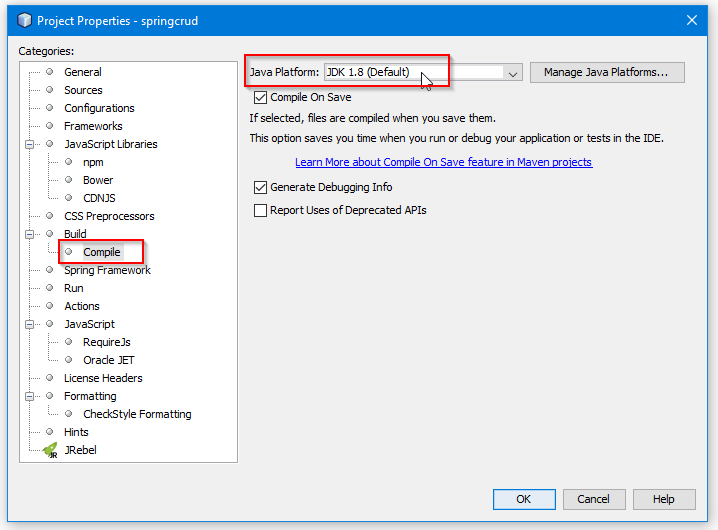
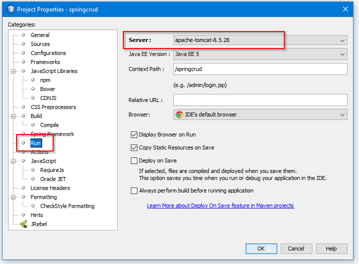
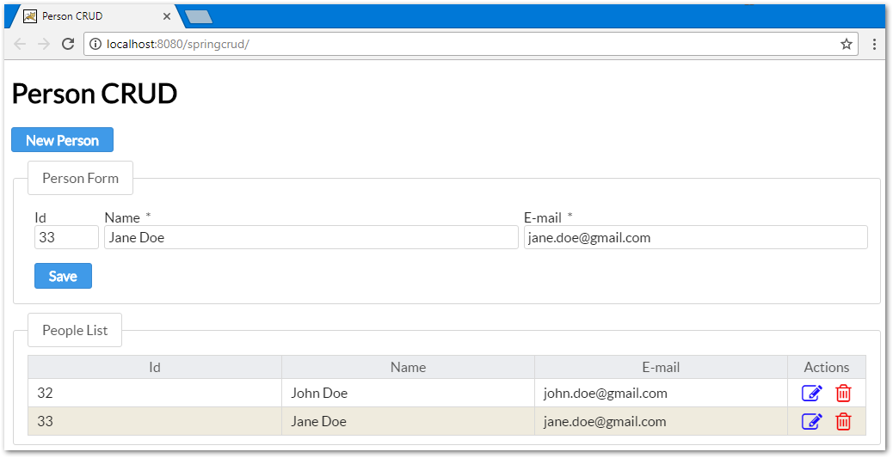
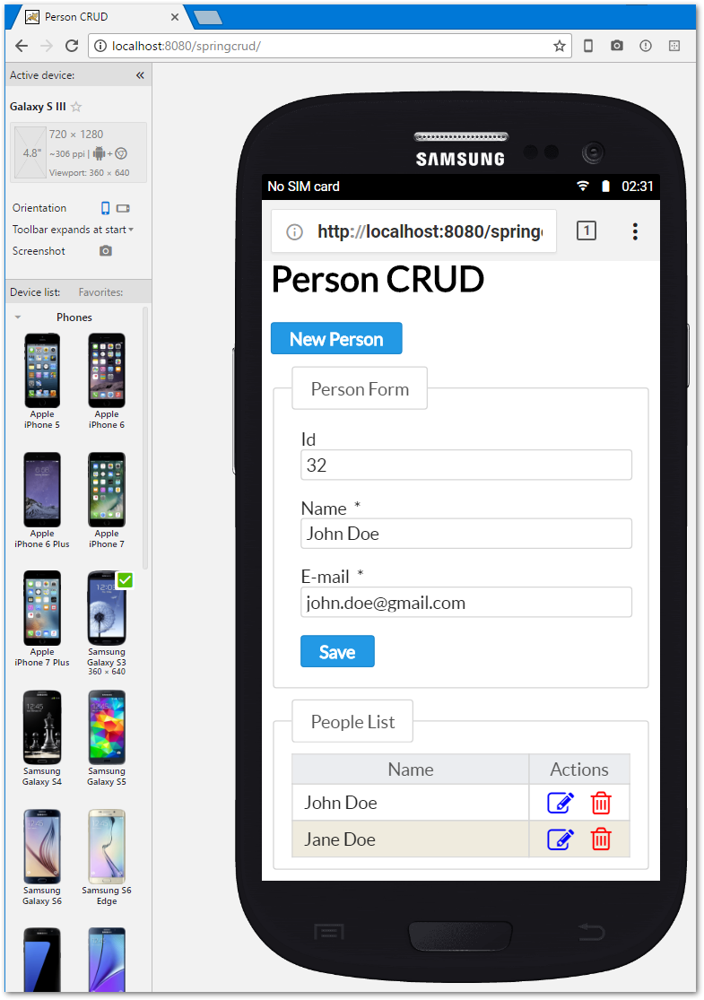
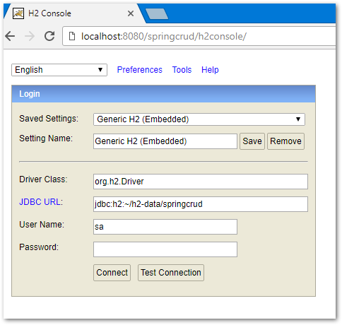

# CRUD web application with responsive design
This project is a simple CRUD web application with responsive design, using Java + Spring Framework + JPA + JSF and other technologies.

## Frameworks and Tools used
### Language
* Java 8 (JDK 1.8)
### Inversion of Control / Dependency Injection / Middleware
* Spring Framework 4.3.x
### Persistence
* JPA 2.1
* Hibernate 5.2.x
* H2 Database 1.4.x (it could be any relational database)
### Presentation / User Interface
* JSF 2.3.x
* Primefaces 6.x
* OmniFaces 2.6.x
### Application Server (Servlet Container, actually)
* Tomcat 8.5.x
### Dependency Management and Build Tool
* Maven 3.0
### IDE
* Netbeans IDE 8.2 (it could be Eclipse IDE or any Maven compatible IDE, or just plain Maven via command line is fine)

## Purpose
The main purpose of this project is to serve as a starting point for those who are struggling to put these above mentioned technologies to work together.

## How to run this project
1. Download **Apache Tomcat 8.5.x** from https://tomcat.apache.org/download-80.cgi ([Windows](https://archive.apache.org/dist/tomcat/tomcat-8/v8.5.28/bin/apache-tomcat-8.5.28.zip) or [Linux](https://archive.apache.org/dist/tomcat/tomcat-8/v8.5.28/bin/apache-tomcat-8.5.28.tar.gz)) and extract it to any folder on your computer
2. Open **Netbeans IDE**, go to "**Services**" window (Ctrl+5), right click on "**Servers**" node and select "**Add Server...**". Select "**Apache Tomcat or TomEE**" on "**Server**" field, change server name if you will and click "**Next**" button. On "**Server Location**", choose the folder where you extracted Tomcat on step 1 above.
3. Still on "**Services**" window, right-click on server you just created under "**Servers**" node and select "**Properties**". Under "**Platform**" tab, choose **JDK 1.8**" in "**Java Platform**" field and **uncheck** "**Use IDE Proxy Settings**" field, as shown below

4. Clone/Fork this project to your machine and open it in Netbeans ("**File**" / "**Open Project...**" menu)
5. In Netbeans, rigth-click on project and select "**Properties**". In "**Sources**" node, select "**1.8**" on "**Sources/Binary Format**" field, as shown below

Under "**Build**" / "**Compile**" node, choose "**JDK 1.8**" in "**Java Platform**" field, as shown below

Under "**Run**" node, "**Server**" field, choose the app server you created in step 2 above and leave other fields as shown below

Close this Project Properties window.

6. Right-click on project and select "**Run**", wait for Tomcat start up and, if your browser won't open automatically, go to http://localhost:8080/springcrud . You'll see something like this:

Desktop mode:

Responsive/Mobile mode:

## Embedded H2 database console
This project comes with a built-in SQL client console, allowing you to access H2 Database that serves as the backend. Just follow the steps below to access it:
1. Run the project (step 6 above) and open the following URL in your browser: http://localhost:8080/springcrud/h2console
2. Enter "**jdbc:h2:~/h2-data/springcrud**" in the "**JDBC URL**" field and click "**Connect**" button, as shown below

3. You can execute any SQL command to show table data, as shown below

